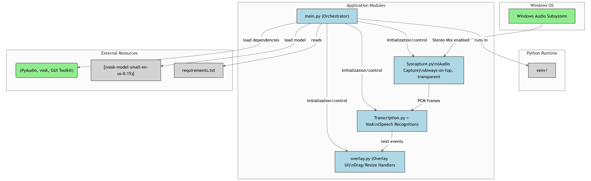

# EchoLine - Real-Time Speech-to-Text Overlay  


EchoLine is a real-time speech-to-text overlay application that displays live captions on your screen. It's perfect for accessibility, transcription, or any scenario where you need live captions.  


## Features  
- Real-time speech-to-text conversion  
- Always-on-top overlay window  
- Adjustable transparency  
- Movable overlay position  
- Scrollable text history  
- Easy exit using **Ctrl + Q** or the **close button**  

## Requirements  
- Python 3.7 or higher  
- Windows operating system  
- Stereo Mix enabled in sound settings  

## Installation & Setup  

1. **Clone this repository:**  
   ```bash
   git clone https://github.com/coderconnoisseur/EchoLine.git
   cd EchoLine
2. **Install the dependencies:**
   ```bash
   pip install -r requirements.txt
3. **Download and install the Vosk model:**
   ->Download from: Vosk Models
   ->Choose: vosk-model-small-en-us-0.15
   ->Extract the model to:
   ```bash
   C:\Users\<YourUsername>\.cache\vosk\
4. **Run the application:**
   ```bash
   python main.py
5. **Close the overlay**:
   Press Ctrl + Q, or
   Click the X (close button) on the top-right corner of the overlay window.

## Usage

The overlay will appear at the bottom of your screen

Speak into your microphone or play any audio to see live captions

Click and drag to move the overlay window

The window automatically scrolls to show the latest text

## Troubleshooting
   No Audio Captured

  ->Ensure Stereo Mix is enabled and set as default
  ->Check that your audio output is not muted
  
   Model Not Found

   ->Verify the Vosk model is in:
   ```bash
C:\Users\<YourUsername>\.cache\vosk\vosk-model-small-en-us-0.15
